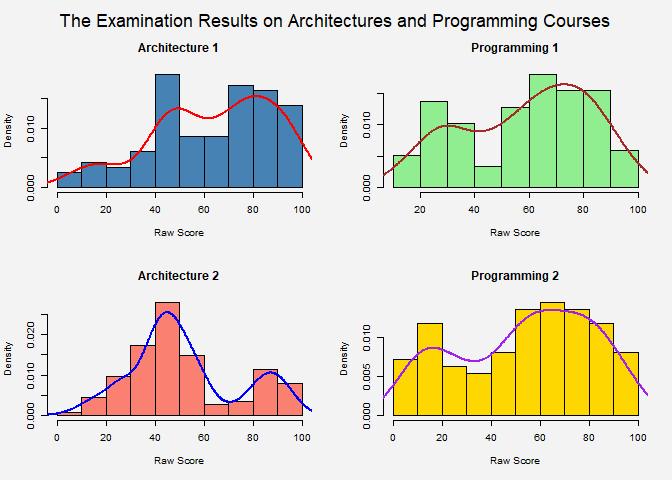
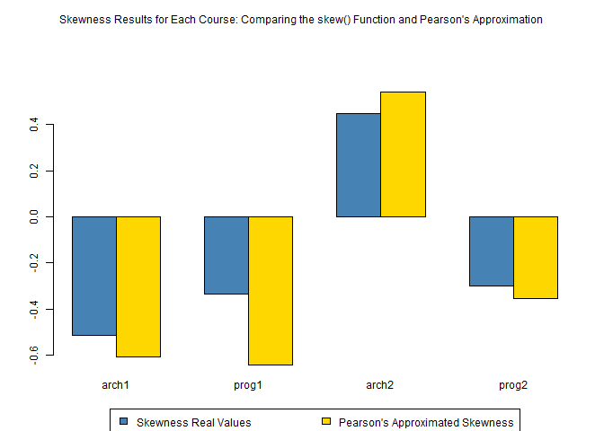
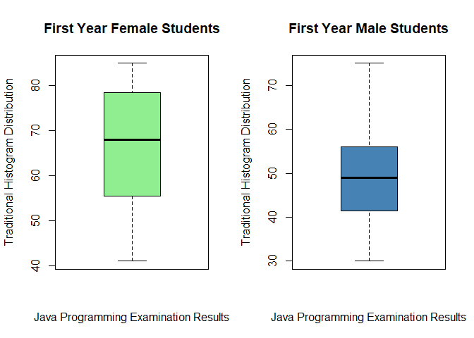

Formative Assessment 1 in Probability
================
John Benedict A. Monfero
1 February 2024

## The Pearsons Skewness Coefficient Appoximation

Write the skewness program, and use it to calculate the skewness
coefficient of the four examination subjects in results.txt
(results.csv). *The file can be retreived in this
[github](https://github.com/Monferium/APM1110/blob/FA1_Behind-the-Scenes/results.csv)
link*. What can you say about these data?

``` r
# Extract the dataframe in the R environment
results <- read.csv("C:/Users/79FV/Downloads/results.csv", header = T)
names(results)
```

    ## [1] "gender" "arch1"  "prog1"  "arch2"  "prog2"

``` r
# "Skewness is a measure of the asymmetry of a distribution. This value can be positive or negative" (Zach, 2024)

# In R, Skewness can be precisely calculated from the function skewness() that come in the 'moments' library
options(repos = c(CRAN = "https://cloud.r-project.org"))
```

``` r
# To begin, install the 'moments' package if it's not already installed
install.packages("moments")
```

    ## package 'moments' successfully unpacked and MD5 sums checked
    ## 
    ## The downloaded binary packages are in
    ##  C:\Users\79FV\AppData\Local\Temp\RtmpgnesfV\downloaded_packages

``` r
# Secondly, through this specific library, we can automatically calculate the skewness

library(moments) # Enabling the skewness() and kurtosis() function

# In Horgan (2020), the equation 2.1 highlights that skewness of the data can be recalculated as:
# skewness = 3 * (mean - median)/standard deviation but only as approximation
auto_skew <- sapply(results[,2:5], skewness, na.rm = TRUE)
names(auto_skew) <- colnames(results)[2:5]
print(auto_skew)
```

    ##      arch1      prog1      arch2      prog2 
    ## -0.5129462 -0.3334265  0.4481600 -0.3018269

References: - Zach. (2024, January 24). How to calculate skewness &
Kurtosis in r. Statology.
<https://www.statology.org/skewness-kurtosis-in-r/>

### Pearson Skewness Coefficient Apprroximation Formula

$$
\text{skew} \approx \frac{3*(mean - median)}{standard\ deviation}
$$

``` r
# Apply the skewness calculation as an anonymous function within sapply
data_skewness <- sapply(results[, 2:5], function(x) {
  # To emphasize once more, skewness = 3 * (mean - median)/standard deviation according to equation 2.1 (Horgan, 2020)
  3 * (mean(x, na.rm = TRUE) - median(x, na.rm = TRUE))/sd(x, na.rm = TRUE)
})     
# Name the elements of the vector with the column names
names(data_skewness) <- colnames(results)[2:5]

# Print the skewness for each column
print(data_skewness)
```

    ##      arch1      prog1      arch2      prog2 
    ## -0.6069042 -0.6432290  0.5421286 -0.3562908

Remember, *‘auto\_skew’* vector holds the following skewness values
computed from the ‘skewness()’ function from the ‘library(moments)’

*‘data\_skewness’*, on the other hand, holds the values that the
Pearson’s Skewness Approximation Formula

``` r
# Determine the percentage of error between theoretical values in 'auto_skew' than the experimental values in 'data_skewness':

# Assuming auto_skew contains real skewness values and data_skewness contains the approximations

# Calculate the absolute error
absolute_error <- abs(auto_skew - data_skewness)

# Calculate the relative error
relative_error <- absolute_error / abs(auto_skew)

# Calculate the percentage of error
percentage_error <- relative_error * 100

# Print the percentage of error for each column
print(percentage_error)
```

    ##    arch1    prog1    arch2    prog2 
    ## 18.31731 92.91475 20.96763 18.04474

Remarks: *This implies that the values between the Skewness value than
Pearson’s Skewness approximation is about 20% margin of error for the
distributions on arch1, arch2, and prog2; prog1 has above 90%*.
Nonetheless, all of the Pearson’s Approximation is enough to distinguish
which are left or right skewed but not ideally to knowing the instensity
of the skewness.

## Plot parts

``` r
# Set the outer margin to provide space for the main title, adjust the top margin as needed
par(oma = c(0.1, 0, 2, 0))

# We can quickly visualize the distribution of values in this dataset by creating a histogram:
par(mfrow=c(2,2), bg = "#f3f3f3", cex = 0.6)

hist(na.omit(results$arch1), col ='steelblue', main="Architecture 1", xlab = "Raw Score", probability = TRUE)
lines(density(na.omit(results$arch1)), col="red", lwd=2)
hist(na.omit(results$prog1), col ='lightgreen', main="Programming 1", xlab = "Raw Score", probability = TRUE)
lines(density(na.omit(results$prog1)), col="brown", lwd=2)
hist(na.omit(results$arch2), col ='salmon', main="Architecture 2", xlab = "Raw Score", probability = TRUE)
lines(density(na.omit(results$arch2)), col="blue", lwd=2)
hist(na.omit(results$prog2), col ='gold', main="Programming 2", xlab = "Raw Score", probability = TRUE)
lines(density(na.omit(results$prog2)), col="purple", lwd=2)

# Add a main title
mtext("The Examination Results on Architectures and Programming Courses", side = 3, line = -0.5, outer = TRUE, cex = 1.10)
```

<!-- -->

Considering the results we have in the Pearson’s Skewness Value, the
figure above also depicts the following: ‘arch1’,‘prog1’, and ‘prog2’
has the negative skewness, meaning their distributions of median and
mode much likely higher than the mean of each histogram distribution.
Likewise, ‘arch2’ has the positive skewness.

### Conclusion

$$
\text{skew} = \frac{\sqrt{n} \sum_{i=1}^{n} (x_i - \bar{x})^3}{\left( \sum_{i=1}^{n} (x_i - \bar{x})^2 \right)^{3/2}}
$$ versus

$$
\text{skew} \approx \frac{3*(mean - median)}{standard\ deviation}
$$

``` r
# Assuming you have your data in two vectors, library_skew and pearson_skew:

skewness_real_values <- c(auto_skew[1], auto_skew[2], auto_skew[3], auto_skew[4])
skewness_pearson_approximation <- c(data_skewness[1], data_skewness[2], data_skewness[3], data_skewness[4])

# Combine the data into a matrix
skew_data <- rbind(skewness_real_values, skewness_pearson_approximation)

# Set up outer margins to leave space for the main title
par(oma = c(0, 0, 3, 0), cex = 0.75)

# Plot without the legend
bp <- barplot(skew_data, beside = TRUE, 
              col = c("steelblue", "gold"), 
              names.arg = c("arch1", "prog1", "arch2", "prog2"))

# Add a main title with adjusted outer margins
mtext("Skewness Results for Each Course: Comparing the skew() Function and Pearson's Approximation", 
      side = 3, line = 1, outer = TRUE, cex = 0.75)

# Reset the outer margin back to default if necessary for further plotting
par(oma = c(0, 0, 0, 0))

# Add the legend below the plot
legend("bottom", inset = c(0, -0.25),  # Adjust inset as necessary
       legend = c("Skewness Real Values", "Pearson's Approximated Skewness"), 
       fill = c("steelblue", "gold"), 
       horiz = TRUE, xpd = TRUE)
```

<!-- -->

*Here is the following interpretations, and insights in the given
project and its experiment:* Since the distribution, sample size, and
outliers are very present in each dataset (arch1, prog1, arch2, and
prog2) - All of these, Skewness Real Values (Steelblue color) are either
underestimated and overestimaded by its Pearson’s Approximations
Counterparts - arch1, prog1, and prog2 does have negative skewness
coefficients (both in approximations and its true value), meaning that
most students are above the average results, as the negative skewness
implies that the mode and median are surely located at the right side of
the distribution, therefore, the left tail of the distribution are very
flat. the arch2 results has the otherwise implications, since it has the
positive skewness.

*Pearson’s Approximated Skewness was beneficial enough to some datasets
as it can predicts which skewness type of your dataset has, but not
neccesary the intensity of it, since the significance difference is much
likely to be noticed especially on ‘prog1’ (programming 1) course about
90% margin of error.*

## Scenario B: The 50 students on JavaScript Examination Results

For the class of 50 students of computing detailed in Exercise 1.1, use
R to

``` r
# In a class of 50 students of computing, 23 are female and 27 are male. 
# The results of their first-year Java programming examination are given as follows

Females <- c(57, 59, 78, 79, 60, 65, 68, 71, 75, 48, 51, 55, 56, 41, 43,
             44, 75, 78, 80, 81, 83, 83, 85)
Males <- c( 48, 49, 49, 30, 30, 31, 32, 35, 37, 41, 86, 42, 51, 53, 56,
            42, 44, 50, 51, 65, 67, 51, 56, 58, 64, 64, 75)

Dataset <- c(Females, Males)
```

``` r
# If it was discovered that the mark for the 34th student was entered incorrectly 
# Should have been 46 instead of 86, use an appropriate editing procedure to change this.

Dataset[34] <- 46
Males[11] <- 46
```

#### Form the stem-and-leaf display for each gender, and discuss the advantages of this representation compared to the traditional histogram;

``` r
stem(Females); stem(Males)
```

    ## 
    ##   The decimal point is 1 digit(s) to the right of the |
    ## 
    ##   4 | 1348
    ##   5 | 15679
    ##   6 | 058
    ##   7 | 155889
    ##   8 | 01335

    ## 
    ##   The decimal point is 1 digit(s) to the right of the |
    ## 
    ##   3 | 0012
    ##   3 | 57
    ##   4 | 1224
    ##   4 | 6899
    ##   5 | 01113
    ##   5 | 668
    ##   6 | 44
    ##   6 | 57
    ##   7 | 
    ##   7 | 5

*The Illustration for signifying the distribution of the small sample
sizes*, we can see the divisions of these leaves clearly by the second
digit of the 50 student’s scores in Javascript Exam Result. Easier to
navigate which one are the lowest, highest leaf value on the bottomost
part of the stem. However, take granted an example that, we would have
1000 sample to be display their data through stem-leaf, then, the
congestions on each leaf is much more distrubting, it does not help at
all to convey the intended message, that is why stem-leaf is a good
discrete ranking values for small criteria, whenever that is much
larger, we need to summarizes each of the category, which lead us to the
utilization of the well-known traditional histograms.

``` r
# Form the stem-and-leaf display for each gender, and discuss the advantages of this representation compared to the traditional histogram; 
par(mfrow=c(1,2))

hist(Females, col = 'salmon', main = "First Year Female Students", xlab = "Java Programming Examination Results", ylab = "Traditional Histogram Distribution", probability = TRUE)
lines(density(Females), col="blue", lwd=2)
hist(Males, col = 'gold', main = "First Year Male Students", xlab = "Java Programming Examination Results", ylab = "Traditional Histogram Distribution", probability = TRUE)
lines(density(Males), col="violet", lwd=2)
```

<!-- -->

*Histograms can be look much ordinary squares when the sample size to be
presented is kinda small*, and it does not excel well to resummarize
visual meanings when the sample is very small in the first place, it is
much more obvious to utlize stem leaf or tabular results under these
conditions.

#### Construct a box-plot for each gender and discuss the findings.

``` r
# Construct a box-plot for each gender and discuss the findings. 
par(mfrow=c(1,2))
boxplot(Females, col = 'lightgreen', main = "First Year Female Students", xlab = "Java Programming Examination Results", ylab = "Traditional Histogram Distribution")
boxplot(Males, col = 'steelblue', main = "First Year Male Students", xlab = "Java Programming Examination Results", ylab = "Traditional Histogram Distribution")
```

<!-- -->

Since boxplots can be a brilliant strategy to visually illustrates the
inter-quartile ranges of the given dataset, the specific median mark on
each distribution and of course, which distributions had the significant
outliers: 1. There are no obvious outliers of scores observe in both
gender, since the maximum and the minimum extremes had the remaining
distribution, no outside of them had at least one other value. 2. If we
put into ranking of their scores, the median of the Female’s group is
higher than Male for about 20 points. 3. We specifically calculate the
interquartile ranges, to determine the median, lower quartile, upper
quartile, lower and upper extreme.

``` r
# Function to calculate the summary statistics including IQR
summary_statistics <- function(scores) {
  median_score <- median(scores)
  lower_quartile <- quantile(scores, 0.25)
  upper_quartile <- quantile(scores, 0.75)
  IQR_score <- IQR(scores)
  
  list(
    Median = median_score,
    Lower_Quartile = lower_quartile,
    Upper_Quartile = upper_quartile,
    IQR = IQR_score
  )
}
```

``` r
# Calculate summary statistics for Females
female_stats <- summary_statistics(Females)
print("Female Students' Statistics")
```

    ## [1] "Female Students' Statistics"

``` r
print(female_stats)
```

    ## $Median
    ## [1] 68
    ## 
    ## $Lower_Quartile
    ##  25% 
    ## 55.5 
    ## 
    ## $Upper_Quartile
    ##  75% 
    ## 78.5 
    ## 
    ## $IQR
    ## [1] 23

``` r
# Calculate summary statistics for Males
male_stats <- summary_statistics(Males)
print("Male Students' Statistics")
```

    ## [1] "Male Students' Statistics"

``` r
print(male_stats)
```

    ## $Median
    ## [1] 49
    ## 
    ## $Lower_Quartile
    ##  25% 
    ## 41.5 
    ## 
    ## $Upper_Quartile
    ## 75% 
    ##  56 
    ## 
    ## $IQR
    ## [1] 14.5

4.  turns out, the median for female and male scores are 68, then 49
    respectively. Further signify the item 2 interpretation.
5.  The lower quartile of the female, is closely the upper quartile of
    the male, making both distribution further suggests that the scores
    they achieved by gender is statisitically significant difference.
