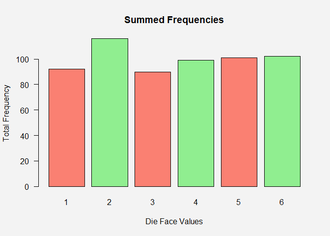

Formative Assessment 2: Extras
================
John Benedict A. Monfero
2024-02-12

## An experiment consists of tossing two fair coins.

### Use R to simulate this experiment 100 times and obtain the relative frequency of each possible outcome. Hence, estimate the probability of getting one head and one tail in any order.

``` r
# Enumerate the sample space whenever two fairs coins tossed:
sample_space <- c("HH", "HT", "TH", "TT")
# In R, we can simulate the relative frequency of the tossing two coin experiment with 100 repetitions through sample() function
experiment_100 <- sample(sample_space, 100, replace = T)

# Preliminary Program Output
print("Here is the frequency distribution of the experiment of tossing two fair coins")
```

    ## [1] "Here is the frequency distribution of the experiment of tossing two fair coins"

``` r
print("HH, and TT are the not desired events, HT and TH are favorable events")
```

    ## [1] "HH, and TT are the not desired events, HT and TH are favorable events"

``` r
table(experiment_100)
```

    ## experiment_100
    ## HH HT TH TT 
    ## 29 24 21 26

``` r
par(bg = "#f3f3f3")
HH_events <- sum(experiment_100 == "HH")
favored_events <- sum(experiment_100 == "HT" | experiment_100 == "TH")
TT_events <- sum(experiment_100 == "TT")

barplot(c("HH" = HH_events, "HT + TH" = favored_events, "TT" = TT_events),  main = "Experiment consists two tossing coins", xlab = "Events in tossing two coins", ylab = "Total Frequency", col = c("steelblue", "gold", "steelblue"), las = 1)
```

<!-- -->

$$
P(HT\, \cup \, TH) = P(HT) + P(TH) - P(HT \, \cap \, TH)
$$

``` r
# Calculate the total number of events
total_events <- HH_events + favored_events + TT_events

# Calculate the relative frequency for each outcome
relative_frequency_HH <- HH_events / total_events
relative_frequency_favored <- favored_events / total_events
relative_frequency_TT <- TT_events / total_events

# Output the relative frequencies
relative_frequencies <- c(HH=relative_frequency_HH, Favored=relative_frequency_favored, TT=relative_frequency_TT)
print(paste("Hence the estimation of probability of getting a head and a tail in any order would be", relative_frequency_favored))
```

    ## [1] "Hence the estimation of probability of getting a head and a tail in any order would be 0.45"

``` r
relative_frequencies
```

    ##      HH Favored      TT 
    ##    0.29    0.45    0.26

## An experiment consists of rolling a die.

### Use R to simulate this experiment 600 times and obtain the relative frequency of each possible outcome. Hence, estimate the probability of getting each of 1, 2, 3, 4, 5, and 6.

``` r
# When a die (one dice) rolled, enumerate the event possibilities that an even number appears.
even <- c(2,4,6)
# When a die (one dice) rolled, enumerate the event possibilities that not an even number appears.
odd <- c(1,3,5)

# A die whose holding its universal events (sample).
die <- c(even, odd)

# Store the result of the experiment 600 times in a variable
roll_results <- sample(die, 600, replace = T)

# Count the number of times each result appears
roll_counts <- table(roll_results)

# Create a bar plot with these counts
barplot(roll_counts, main = "Summed Frequencies", xlab = "Die Face Values", ylab = "Total Frequency", 
        col = c("salmon", "lightgreen", "salmon", "lightgreen", "salmon", "lightgreen"), las = 1)
```

<!-- -->

$$
\text{Sample Space} \quad= \quad 600\; \text{Events} \quad = \quad E_1 + E_2 + E_3 + E_4 + E_5 + E_6
\\
100\% = P(E_1)+P(E_2)+P(E_3)+P(E_4)+P(E_5)+P(E_6)
$$

``` r
# Output the relative frequencies
relative_frequencies <- c(HH=relative_frequency_HH, Favored=relative_frequency_favored, TT=relative_frequency_TT)
print(paste("Hence the estimation of probability of getting a head and a tail in any order would be", relative_frequency_favored))
```

    ## [1] "Hence the estimation of probability of getting a head and a tail in any order would be 0.45"

``` r
relative_frequencies
```

    ##      HH Favored      TT 
    ##    0.29    0.45    0.26
