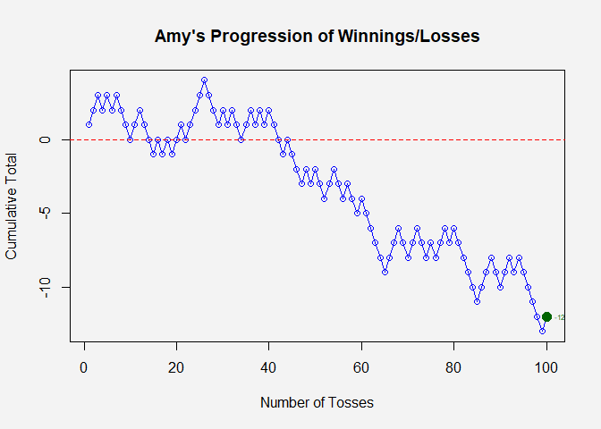

Formative Assessment 2: Extras
================
John Benedict A. Monfero
2024-02-12

# Number Two

## An experiment consists of tossing two fair coins.

### Use R to simulate this experiment 100 times and obtain the relative frequency of each possible outcome. Hence, estimate the probability of getting one head and one tail in any order.

``` r
# Enumerate the sample space whenever two fairs coins tossed:
sample_space <- c("HH", "HT", "TH", "TT")
# In R, we can simulate the relative frequency of the tossing two coin experiment with 100 repetitions through sample() function
experiment_100 <- sample(sample_space, 100, replace = T)

# Preliminary Program Output
print("Here is the frequency distribution of the experiment of tossing two fair coins")
```

    ## [1] "Here is the frequency distribution of the experiment of tossing two fair coins"

``` r
print("HH, and TT are the not desired events, HT and TH are favorable events")
```

    ## [1] "HH, and TT are the not desired events, HT and TH are favorable events"

``` r
table(experiment_100)
```

    ## experiment_100
    ## HH HT TH TT 
    ## 27 25 23 25

``` r
par(bg = "#f3f3f3")
HH_events <- sum(experiment_100 == "HH")
favored_events <- sum(experiment_100 == "HT" | experiment_100 == "TH")
TT_events <- sum(experiment_100 == "TT")

barplot(c("HH" = HH_events, "HT + TH" = favored_events, "TT" = TT_events),  main = "Experiment consists two tossing coins", xlab = "Events in tossing two coins", ylab = "Total Frequency", col = c("steelblue", "gold", "steelblue"), las = 1)
```

<!-- -->

$$
P(HT\, \cup \, TH) = P(HT) + P(TH) - P(HT \, \cap \hspace{3 pt} TH)
$$

``` r
# Calculate the total number of events
total_events <- HH_events + favored_events + TT_events

# Calculate the relative frequency for each outcome
relative_frequency_HH <- HH_events / total_events
relative_frequency_favored <- favored_events / total_events
relative_frequency_TT <- TT_events / total_events

# Output the relative frequencies
relative_frequencies <- c("HH" = relative_frequency_HH, "HT or TH" = relative_frequency_favored, "TT" = relative_frequency_TT)
print(paste("Hence the estimation of probability of getting a head and a tail in any order would be", relative_frequency_favored*100, "%"))
```

    ## [1] "Hence the estimation of probability of getting a head and a tail in any order would be 48 %"

``` r
relative_frequencies
```

    ##       HH HT or TH       TT 
    ##     0.27     0.48     0.25

# Number Three

## An experiment consists of rolling a die.

### Use R to simulate this experiment 600 times and obtain the relative frequency of each possible outcome. Hence, estimate the probability of getting each of 1, 2, 3, 4, 5, and 6.

``` r
# When a die (one dice) rolled, enumerate the event possibilities that an even number appears.
even <- c(2,4,6)
# When a die (one dice) rolled, enumerate the event possibilities that not an even number appears.
odd <- c(1,3,5)

# A die whose holding its universal events (sample).
die <- c(even, odd)

# Store the result of the experiment 600 times in a variable
roll_results <- sample(die, 600, replace = T)

# Count the number of times each result appears
roll_counts <- table(roll_results)

par(bg = "#f3f3f3")
# Create a bar plot with these counts
barplot(roll_counts, main = "Summed Frequencies", xlab = "Die Face Values", ylab = "Total Frequency", 
        col = c("salmon", "lightgreen", "salmon", "lightgreen", "salmon", "lightgreen"), las = 1)
```

<!-- -->

### Since the experiment is made 600 times, therefore the sample space also has 600 events where all came from 6 different favorable events

$$
\text{Sample Space} \hspace{3pt}= \hspace{3pt} 600 \hspace{3pt} \text{Events} \hspace{3pt} = \hspace{3pt} E_1 + E_2 + E_3 + E_4 + E_5 + E_6
$$

``` r
# Determine the relative frequencies on each events
roll_counts/600
```

    ## roll_results
    ##         1         2         3         4         5         6 
    ## 0.1533333 0.1533333 0.1783333 0.1766667 0.1666667 0.1716667

``` r
print(paste("To begin, the relative probability on getting 1 on the given rolling a die experiment is: ", round(roll_counts[1]/600, 4)))
```

    ## [1] "To begin, the relative probability on getting 1 on the given rolling a die experiment is:  0.1533"

``` r
print(paste("Secondly, the relative probability on getting 2 on the given rolling a die experiment is: ", round(roll_counts[2]/600, 4)))
```

    ## [1] "Secondly, the relative probability on getting 2 on the given rolling a die experiment is:  0.1533"

``` r
print(paste("Moreover, the relative probability on getting 3 on the given rolling a die experiment is: ", round(roll_counts[3]/600, 4)))
```

    ## [1] "Moreover, the relative probability on getting 3 on the given rolling a die experiment is:  0.1783"

``` r
print(paste("Fourthly, the relative probability on getting 4 on the given rolling a die experiment is: ", round(roll_counts[4]/600, 4)))
```

    ## [1] "Fourthly, the relative probability on getting 4 on the given rolling a die experiment is:  0.1767"

``` r
print(paste("Subsequently, the relative probability on getting 5 on the given rolling a die experiment is: ", round(roll_counts[5]/600, 4)))
```

    ## [1] "Subsequently, the relative probability on getting 5 on the given rolling a die experiment is:  0.1667"

``` r
print(paste("Lastly, the relative probability on getting 6 on the given rolling a die experiment is: ", round(roll_counts[6]/600, 4)))
```

    ## [1] "Lastly, the relative probability on getting 6 on the given rolling a die experiment is:  0.1717"

### The sample probability shall be 100%

$$
P(S)= 100\% = P(E_1)+P(E_2)+P(E_3)+P(E_4)+P(E_5)+P(E_6)
$$

``` r
prob_sample_space_die <- roll_counts[1]/600 + roll_counts[2]/600 + roll_counts[3]/600 + roll_counts[4]/600 + roll_counts[5]/600 + roll_counts[6]/600
print(paste("The probability of the sample space {getting 1,2,3,4,5 or 6} from a rollng die would be: ", prob_sample_space_die*100,"%"))
```

    ## [1] "The probability of the sample space {getting 1,2,3,4,5 or 6} from a rollng die would be:  100 %"

# Number Four

## Amy and Jane are gambling together

### A fair coin is tossed repeatedly. Each time a head comes up, Amy wins two euro from Jane, and each time a tail comes up, Amy loses two euro to Jane. Use R to simulate this game 100 times, and estimate:

``` r
# Function to calculate the cumulative sum of winnings or losses
calculate_cumulative_total <- function(gambling_simulation) {
  heads_count <- cumsum(gambling_simulation == 2)
  tails_count <- cumsum(gambling_simulation == -2)
  # Assuming Amy wins on heads and Jane wins on tails
  amy_total <- heads_count - tails_count
  return(amy_total)
}

# Run one long simulation
gambling_simulation <- sample(c(2, -2), 100, replace = TRUE)

# Calculate the cumulative total after each trial
gambling_result <- calculate_cumulative_total(gambling_simulation)

par(bg = "#f3f3f3")
# Plot the progression of cumulative winnings or losses
plot(1:100, gambling_result, type = "o", col = "blue",
     xlab = "Number of Tosses", ylab = "Cumulative Total", main = "Amy's Progression of Winnings/Losses")

# Optional: Add a horizontal line at y=0 to show the break-even point
abline(h = 0, col = "red", lty = 2)

# Highlight the last trial
last_trial <- length(gambling_result)
last_value <- gambling_result[last_trial]

# Add a point for the last trial
points(last_trial, last_value, col = "darkgreen", pch = 19, cex = 1.5)

# Annotate the plot with the value of the last trial
text(last_trial, last_value, labels = paste(last_value, sep=""), cex = 0.5, col = "darkgreen", pos = 4)
```

<!-- -->

#### Estimate the number of times that Amy is ahead in these 100 tosses;

``` r
# Calculate the number of times Amy is ahead
times_ahead <- sum(gambling_result > 0)

# Print the number of times Amy is ahead
print(paste("In the gambling simulation so far, Amy is winning ahead from debt or break-even line by", times_ahead, "times!"))
```

    ## [1] "In the gambling simulation so far, Amy is winning ahead from debt or break-even line by 5 times!"

#### Estimate how much Amy has won or lost after 100 tosses.

``` r
# Assuming gambling_result contains the cumulative total of Amy's winnings/losses after 100 tosses
final_result <- gambling_result[100]

# Conditional statements to determine the message output
if (final_result > 0) {
  message <- paste("After 100 tosses, Amy is ahead by", final_result, "euros.")
} else if (final_result < 0) {
  message <- paste("After 100 tosses, Amy is behind by", abs(final_result), "euros.")
} else {
  message <- "After 100 tosses, Amy has broken even."
}

# Print the message
print(message)
```

    ## [1] "After 100 tosses, Amy is behind by 12 euros."
