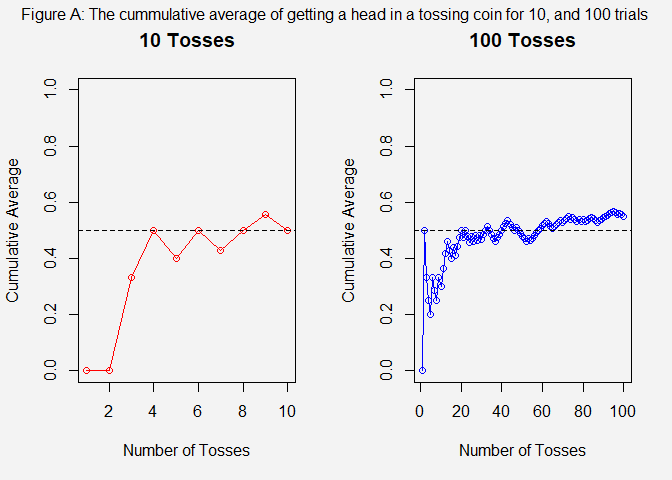
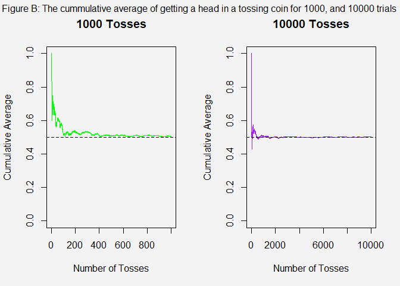
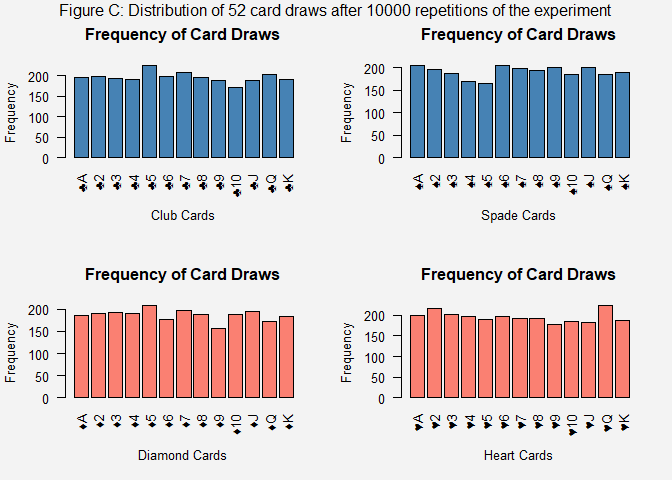
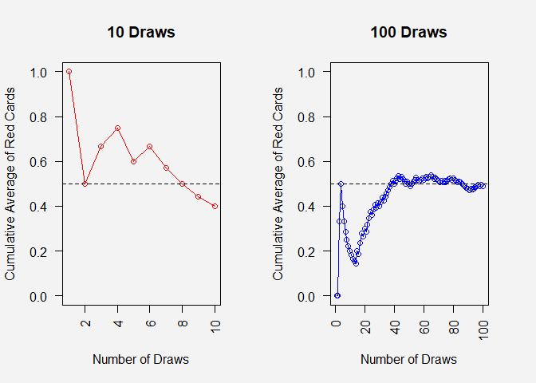
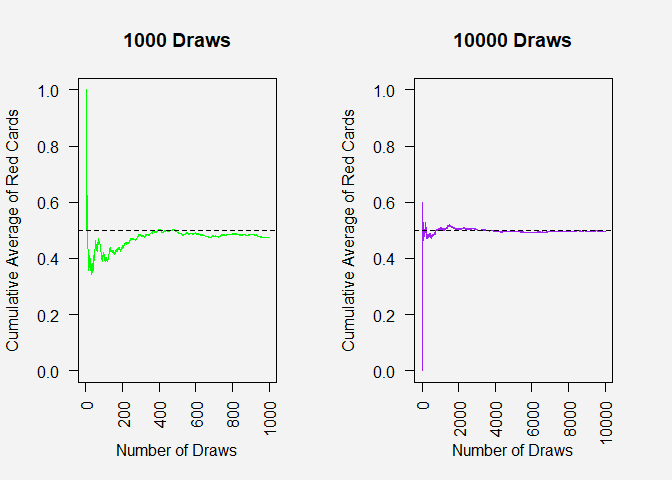
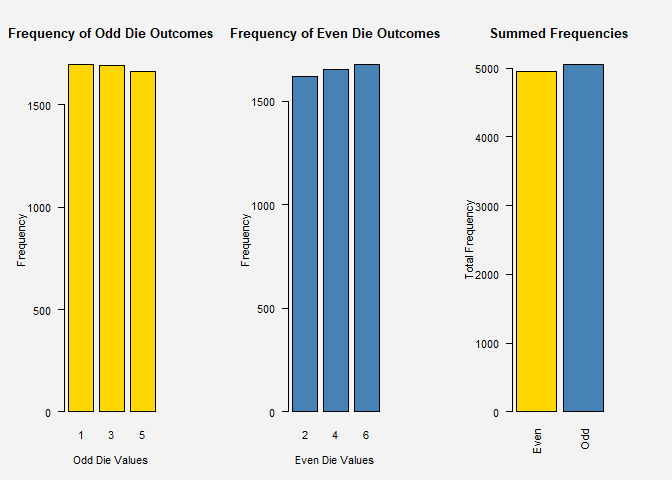
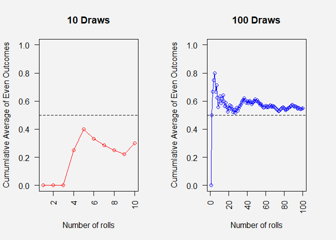
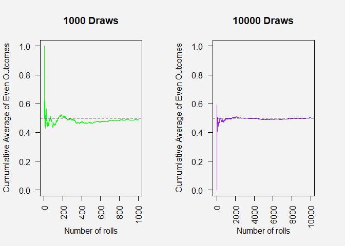

Formative Assessment 2
================
John Benedict A. Monfero
2024-02-05

### Use R to illustrate that the probability of getting:

#### A head is 0.5 if a fair coin tossed repeatedly

``` r
# In R, we can simulate the relative frequency of the tossing coin experiment (E10, E50, E100, and E500) through sample() function
tosses_10 <- sample(c("H", "T"), 10, replace = TRUE)
tosses_100 <- sample(c("H", "T"), 100, replace = TRUE)
tosses_1000 <- sample(c("H", "T"), 1000, replace = TRUE)
tosses_10000 <- sample(c("H", "T"), 10000, replace = TRUE)

# table(tosses_10); table(tosses_100); table(tosses_1000); table(tosses_10000)
#To obtain the relative probabilities, we divide each table() function with the trials made
print("The relative probabilities has been simulated for the 10, 100, 1000, 10000 repeated trials of tossing a coin!")
```

    ## [1] "The relative probabilities has been simulated for the 10, 100, 1000, 10000 repeated trials of tossing a coin!"

``` r
table (tosses_10)/10; table (tosses_100) /100; table (tosses_1000)/1000; table (tosses_10000)/10000
```

    ## tosses_10
    ##   H   T 
    ## 0.5 0.5

    ## tosses_100
    ##    H    T 
    ## 0.55 0.45

    ## tosses_1000
    ##     H     T 
    ## 0.504 0.496

    ## tosses_10000
    ##      H      T 
    ## 0.5024 0.4976

``` r
print("Observe the plemininary results, as the experiment increases, the chances of heads is much closed to the 50%")
```

    ## [1] "Observe the plemininary results, as the experiment increases, the chances of heads is much closed to the 50%"

## Definition 4.4: The relative frequency and relative probability (Jane, 2020)

#### We want to show that, as a fair tossed coin repeatedly (n repetitions), the limits of getting heads N(E) the probability approaches 0.50

$$
P(E) = \lim_{{n \to \infty}} \frac{N_n(E)}{n} = 0.50
$$

``` r
# Create a function that handles the cumulative average for head as the experiment progresses.
calculate_cumulative_avg <- function(tosses) {
  
  # Cumulative sum of heads (if H then +1, else if T then -1)
  heads_count <- cumsum(tosses == "H") 
  
  heads_count / 1:length(tosses) # Cumulative average of heads
}

# Calculate cumulative averages
cumulative_avg_10 <- calculate_cumulative_avg(tosses_10)
cumulative_avg_100 <- calculate_cumulative_avg(tosses_100)
cumulative_avg_1000 <- calculate_cumulative_avg(tosses_1000)
cumulative_avg_10000 <- calculate_cumulative_avg(tosses_10000)

# Set up the plotting area to have 4 panels (1 row and 2 columns)
par(mfrow=c(1, 2), bg = "#f3f3f3")

# Plot for 10 tosses
plot(1:10, cumulative_avg_10, type = "o", col = "red", ylim = c(0, 1),
     xlab = "Number of Tosses", ylab = "Cumulative Average", main = "10 Tosses")
abline(h = 0.5, lty = 2)

# Plot for 100 tosses
plot(1:100, cumulative_avg_100, type = "o", col = "blue", ylim = c(0, 1),
     xlab = "Number of Tosses", ylab = "Cumulative Average", main = "100 Tosses")
abline(h = 0.5, lty = 2)

# After all individual plots have been drawn
mtext("Figure A: The cummulative average of getting a head in a tossing coin for 10, and 100 trials", 
      outer = TRUE, cex = 1.0, line = -1.2)
```

<!-- -->

``` r
# Plot for 1000 tosses
plot(1:1000, cumulative_avg_1000, type = "l", col = "green", ylim = c(0, 1),
     xlab = "Number of Tosses", ylab = "Cumulative Average", main = "1000 Tosses")
abline(h = 0.5, lty = 2)

# Plot for 10000 tosses
plot(1:10000, cumulative_avg_10000, type = "l", col = "purple", ylim = c(0, 1),
     xlab = "Number of Tosses", ylab = "Cumulative Average", main = "10000 Tosses")
abline(h = 0.5, lty = 2)

# After all individual plots have been drawn
mtext("Figure B: The cummulative average of getting a head in a tossing coin for 1000, and 10000 trials", 
      outer = TRUE, cex = 1.0, line = -1.2)
```

<!-- -->

#### Since, we made an simulation with at most 10000 repetitions of the experiment, we achieved that probability of getting a head is 0.5 if a fair coin tossed repeatedly:

$$
P(E) = \lim_{{n \to 10000}} \frac{N_n(E)}{n} \approx 0.50
$$

### Use R to illustrate that the probability of getting:

#### A red card is 0.5 if cards are drawn repeatedly with replacement from awell-shuffled deck;

##### Note: We will denote the following: Hearts (♥); Diamonds (♦); Spades (♠); Clubs (♣)

``` r
# Enumerate the cards that is categorized as red cards among the 52-standard deck
red <- c(paste0("♥", c("A", 2:10, "J", "Q", "K")), paste0("♦", c("A", 2:10, "J", "Q", "K")))

# Enumerate the cards that is categorized as black cards among the 52-standard deck
black <- c(paste0("♠", c("A", 2:10, "J", "Q", "K")), paste0("♣", c("A", 2:10, "J", "Q", "K")))

#Assign the two vectors as one where a standard-deck would contains:
deck <- c(red, black)

# Create a function that handles simulation of drawing a card where the 'n' is the mutable trials wanting to be made:
draw_cards <- function(n) {
  sample(deck, n, replace = TRUE)
}
```

##### Histogram Distribution of Card Draws whenerver the experiment has been repeatedly done 10,000 times

``` r
# Vector must be numeric so that we can utilize the histogram distributions
card_freq <- table(draw_cards(10000)) 

# Manually specify the order of cards
ordered_cards <- c(paste0("♣", c("A", 2:10, "J", "Q", "K")),
                   paste0("♠", c("A", 2:10, "J", "Q", "K")),
                   paste0("♦", c("A", 2:10, "J", "Q", "K")),
                   paste0("♥", c("A", 2:10, "J", "Q", "K")))
                  

# Reorder 'card_freq' according to 'ordered_cards'
sorted_card_freq <- card_freq[ordered_cards]

# Set the margin to ensure all labels fit
par(mfrow = c(2,2), bg = "#f3f3f3")
par(mar = c(5, 4, 4, 2) + 0.1)  # Increase the bottom margin

barplot(sorted_card_freq[1:13], main = "Frequency of Card Draws", xlab = "Club Cards", ylab = "Frequency", col = "steelblue", las = 2)
barplot(sorted_card_freq[14:26], main = "Frequency of Card Draws", xlab = "Spade Cards", ylab = "Frequency", col = "steelblue", las = 2)

barplot(sorted_card_freq[27:39], main = "Frequency of Card Draws", xlab = "Diamond Cards", ylab = "Frequency", col = "salmon", las = 2)
barplot(sorted_card_freq[40:52], main = "Frequency of Card Draws", xlab = "Heart Cards", ylab = "Frequency", col = "salmon", las = 2)

# After all individual plots have been drawn
mtext("Figure C: Distribution of 52 card draws after 10000 repetitions of the experiment", 
      outer = TRUE, cex = 1.0, line = -1.2)
```

<!-- -->

## Definition 4.4: The relative frequency and relative probability (Jane, 2020)

#### We want to show that, as a card drawed repeatedly from a well shuffled deck (n repetitions), the limits of getting a red card N(E), the probability approaches 0.50

$$
P(E) = \lim_{{n \to \infty}} \frac{N_n(E)}{n} = 0.50
$$

``` r
# Calculate cumulative average for red cards
calculate_cumulative_avg_red <- function(draws) {
  red_count <- cumsum(draws %in% red)
  red_count / 1:length(draws)
}

# Number of card draws to simulate
n_draws <- c(10, 100, 1000, 10000)

# Simulate card draws and calculate cumulative averages
cumulative_avgs_red <- lapply(n_draws, function(n) {
  draws <- draw_cards(n)
  calculate_cumulative_avg_red(draws)
})

# Set up plotting area (1 row and 2 columns)
par(mfrow=c(1, 2), bg = "#f3f3f3")
par(mar = c(5, 4, 4, 3) + 0.1)  # Increase the bottom margin

# Define colors and types for each plot
colors <- c("red", "blue", "green", "purple")
types <- c("o", "o", "l", "l")

# Plot the cumulative averages for red cards
for (i in 1:length(n_draws)) {
  
  color <- colors[i]; type_line <- types[i]
  plot(1:n_draws[i], cumulative_avgs_red[[i]], type = type_line, col = color, las = 2, ylim = c(0, 1),
       xlab = "Number of Draws", ylab = "Cumulative Average of Red Cards",
       main = paste(n_draws[i], "Draws"))
  abline(h = 0.5, lty = 2) # Expected probability line
}
```

<!-- --><!-- -->

#### Since, we made an simulation with at most 10000 repetitions of the experiment, we achieved that probability of getting a red card is 0.5 if cards are drawn repeatedly with replacement from awell-shuffled deck:

$$
P(E) = \lim_{{n \to 10000}} \frac{N_n(E)}{n} \approx 0.50
$$

### Use R to illustrate that the probability of getting:

#### An even number is 0.5 if a fair die is rolled repeatedly

``` r
# When a die (one dice) rolled, enumerate the event possibilities that an even number appears.
even <- c(2,4,6)
# When a die (one dice) rolled, enumerate the event possibilities that not an even number appears.
odd <- c(1,3,5)

# A die whose holding its universal events (sample).
die <- c(even, odd)

# Create a function that handles simulation of rolling a die where the 'n' is the mutable trials wanting to be made:
rolled_die <- function(n) {
  sample(die, n, replace = TRUE)
}

# Store the result of rolled_die(10000) in a variable
roll_results <- rolled_die(10000)

# Calculate the frequencies for odd and even numbers separately
odds_table <- table(roll_results[roll_results %% 2 != 0])
evens_table <- table(roll_results[roll_results %% 2 == 0])

# Set up the plotting area to have 1 row and 3 columns
par(mfrow=c(1, 3), bg = "#f3f3f3")
par(mar = c(5, 5, 5, 5) + 0.1)  # Increase the bottom margin

# Plot the frequency distribution for odd numbers
barplot(odds_table, main = "Frequency of Odd Die Outcomes", xlab = "Odd Die Values", ylab = "Frequency", col = "gold", las = 1)

# Plot the frequency distribution for even numbers
barplot(evens_table, main = "Frequency of Even Die Outcomes", xlab = "Even Die Values", ylab = "Frequency", col = "steelblue", las = 1)

# Store the original frequency that table
frequency_table <- table(roll_results)

# Now let's sum up the frequencies for 2, 4, 6 and 1, 3, 5
even_sum <- sum(frequency_table[c(2, 4, 6)])
odd_sum <- sum(frequency_table[c(1, 3, 5)])

# Create a bar plot with these sums
barplot(c(Even = even_sum, Odd = odd_sum), main = "Summed Frequencies", ylab = "Total Frequency", col = c("gold", "steelblue"), las = 2)
```

<!-- -->
\## Definition 4.4: The relative frequency and relative probability
(Jane, 2020)

#### We want to show that, as a die rolls (n repetitions), the limits of getting an even number N(E), the probability approaches 0.50

$$
P(E) = \lim_{{n \to \infty}} \frac{N_n(E)}{n} = 0.50
$$

``` r
# # Calculate cumulative average for red cards
# calculate_cumulative_avg_red <- function(draws) {
#   red_count <- cumsum(draws %in% red)
#   red_count / 1:length(draws)
# }
# 
# # Number of card draws to simulate
# n_draws <- c(10, 100, 1000, 10000)
# 
# # Simulate card draws and calculate cumulative averages
# cumulative_avgs_red <- lapply(n_draws, function(n) {
#   draws <- draw_cards(n)
#   calculate_cumulative_avg_red(draws)
# })
# 
# # Set up plotting area (1 row and 2 columns)
# par(mfrow=c(1, 2), bg = "#f3f3f3")
# par(mar = c(5, 4, 4, 3) + 0.1)  # Increase the bottom margin
# 
# # Define colors and types for each plot
# colors <- c("red", "blue", "green", "purple")
# types <- c("o", "o", "l", "l")
# 
# # Plot the cumulative averages for red cards
# for (i in 1:length(n_draws)) {
#   
#   color <- colors[i]; type_line <- types[i]
#   plot(1:n_draws[i], cumulative_avgs_red[[i]], type = type_line, col = color, las = 2, ylim = c(0, 1),
#        xlab = "Number of Draws", ylab = "Cumulative Average of Red Cards",
#        main = paste(n_draws[i], "Draws"))
#   abline(h = 0.5, lty = 2) # Expected probability line
# }

# Calculate cumulative average for even outcomes
calculate_cumulative_avg_even <- function(rolls) {
  event_count <- cumsum(rolls %in% even)
  event_count / 1:length(rolls)
}

# Number of a die rolls to simulate
n_rolls <- c(10, 100, 1000, 10000)

# Simulate die rolls and calculate cumulative averages
cumulative_avgs_even <- lapply(n_rolls, function(n) {
  rolls <- rolled_die(n)
  calculate_cumulative_avg_even(rolls)
})

# Set up plotting area (1 row and 2 columns)
par(mfrow = c(1,2), bg = "#f3f3f3")
par(mar = c(5,4,4,3) + 0.1) #Increase the bottom margin

# Plot the cumulative averages for even face value on a die outcomes
for(i in 1:length(n_rolls)) {
  
  color <- colors[i]; type_line <- types[i]
  plot(1:n_rolls[i], cumulative_avgs_even[[i]], type = type_line, col = color, las = 2, ylim = c(0,1), 
       xlab = "Number of rolls", ylab = "Cumumlative Average of Even Outcomes", 
       main = paste(n_rolls[i], "Draws"))
  abline(h = 0.5, lty = 2) # Expected probability line
}
```

<!-- --><!-- -->

## Definition 4.4: The relative frequency and relative probability (Jane, 2020)

#### Since, we made an simulation with at most 10000 repetitions of the experiment, we achieved that probability of getting a red card is 0.5 if a die are rolled repeatedly

$$
P(E) = \lim_{{n \to 10000}} \frac{N_n(E)}{n} \approx 0.50
$$
