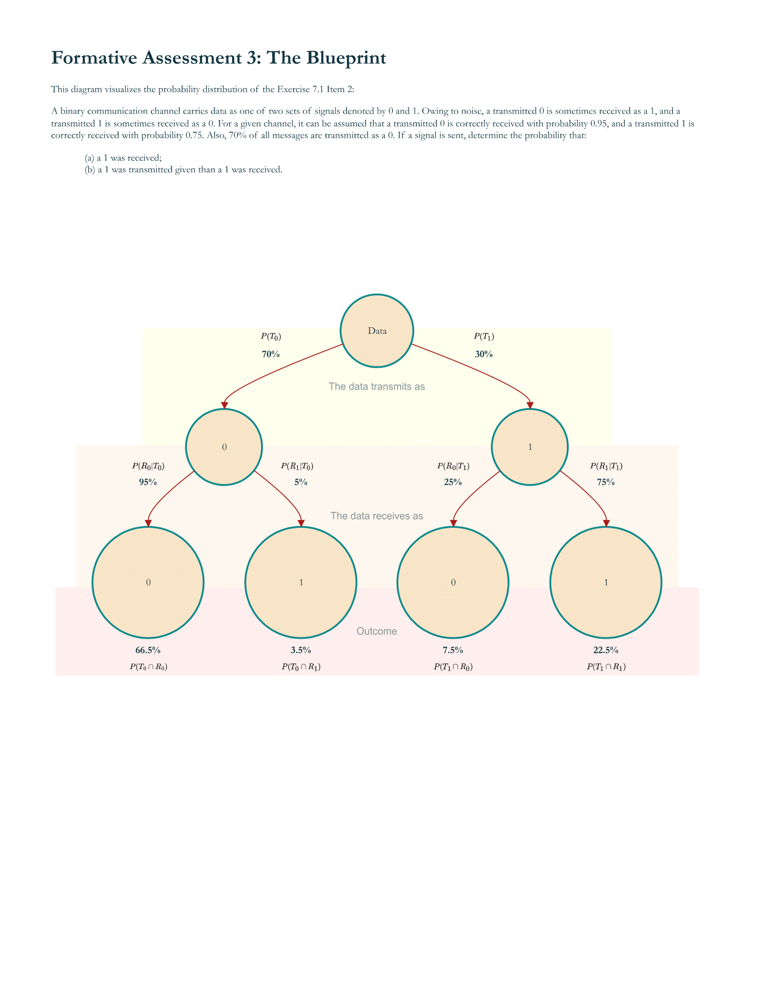
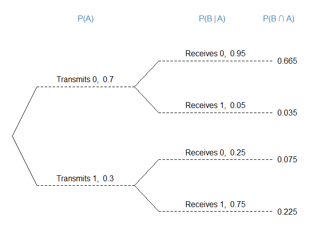
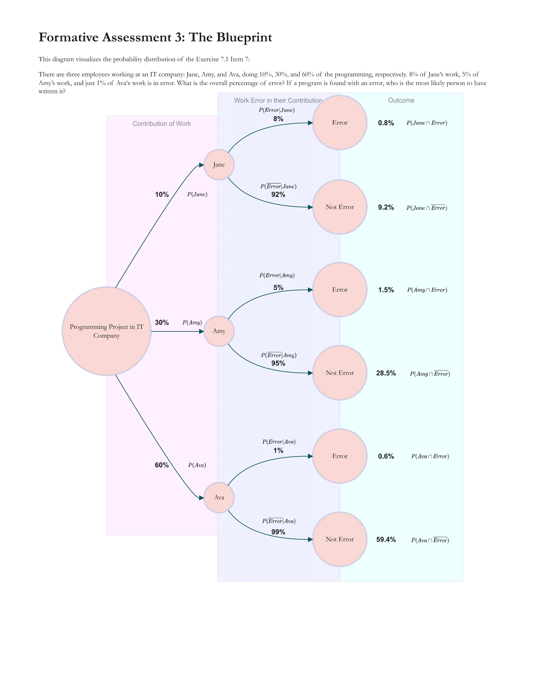
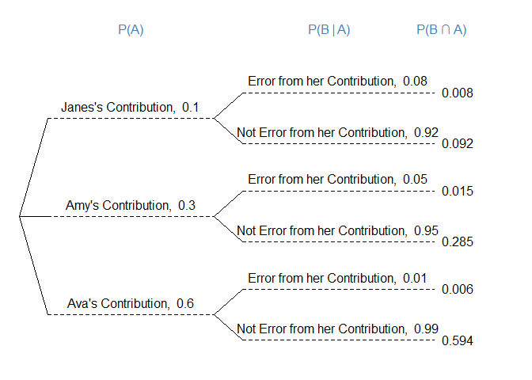

Formative Assessment 3
================
John Benedict A. Monfero
2024-02-14

## Exercise 7.1: Item 2



##### In R, we may utilize the library “openintro” in order to have access to treeDiag function, and create a very simple but sophisticated tree diagram

``` r
library(openintro)
```

    ## Loading required package: airports

    ## Loading required package: cherryblossom

    ## Loading required package: usdata

``` r
# help(treeDiag)
treeDiag(
  c("P(A)", "                               P(B | A)                   P(B ∩ A)"),
  c(0.70, 0.30),
  list(c(0.95, 0.05), c(0.25, 0.75)),
  c("Transmits 0", "Transmits 1"),
  c("Receives 0", "Receives 1"),
  textwd = 0.30,
  solwd = 0.15,
  showSol = TRUE,
  solSub = NULL,
  digits = 3,
  textadj = 0.001,
  cex.main = 1.0,
  col.main = "steelblue",
  showWork = FALSE
)
```

<!-- -->

Figure A: Exercise 7.1 Item 2: Probability Distribution of the Data
Signals

### If signal were sent, find the probability that 1 was receieved4

##### Form the given figure above, in order to determine the probability of receiving 1, regardless whether it transmits 0 or 1

$$
\text{If} \hspace{3pt} R_1 = (T_0 \cap R_1) \hspace{3pt} \cup \hspace{3pt} (T_1 \cap R_1) \hspace{3pt} \text{since recieving 1 can be obtained from both trasmissions of signals}
$$

$$
\text{then} \hspace{3pt} P(R_1) = P(T_0 \cap R_1) + P(T_1 \cap R_1) \hspace{3pt} \text{in order to receive a signal of 1}
$$

$$
\text{By Bayes Theorem, } \hspace{3pt} P(R_1) = P(T_0) \hspace{3pt} P(R_1 | T_0) + P(T_1) \hspace{3pt} P(R_1 | T_1)
$$

$$
\text{Subsitute values: } \hspace{3pt} P(R_1) = (0.70) \hspace{3pt} (0.05) + (0.30) \hspace{3pt} (0.75)
$$

A binary communication channel carries data as one of two sets of
signals denoted by 0 and 1. Owing to noise, a transmitted 0 is sometimes
received as a 1, and a transmitted 1 is sometimes received as a 0. For a
given channel, it can be assumed that a transmitted 0 is correctly
received with probability 0.95, and a transmitted 1 is correctly
received with probability 0.75. Also, 70% of all messages are
transmitted as a 0.

``` r
# In R, determine the probability of that if signal was sent, 1 was received;

## The Data Transmits as
prob_T0 <- 0.70
prob_T1 <- 1 - prob_T0

## The Data receives as 1 or 0 given that they transmit 0, determine the conditional probabilities
prob_R0_given_T0 <- 0.95 
prob_R1_given_T0 <- 1 - prob_R0_given_T0 
## The Data receives as 1 or 0 given that they transmit 1, determine the conditional probabilities
prob_R1_given_T1 <- 0.75
prob_R0_given_T1 <- 1 - prob_R1_given_T1

## By Bayes Theorem, determining the getting T0 and R1; getting T1 and R1 signals through determining the intersection of their probabilities through their conditional and the prior probability of the transmission signals
prob_T0_and_R1 <- prob_R1_given_T0 * prob_T0
prob_T1_and_R1 <- prob_R1_given_T1 * prob_T1

## Display the two variables holding the intersection of probabilities
print(paste("The probability of getting T0 ∩ R1:", prob_T0_and_R1, "or", prob_T0_and_R1*100, "%"))
```

    ## [1] "The probability of getting T0 ∩ R1: 0.035 or 3.5 %"

``` r
print(paste("The probability of getting T1 ∩ R1:", prob_T1_and_R1, "or", prob_T1_and_R1*100, "%"))
```

    ## [1] "The probability of getting T1 ∩ R1: 0.225 or 22.5 %"

``` r
## Finally, determine the summation of these two probabilities in order to determine whenever the signal was sent, 1 was received;

prob_R1 <- prob_T0_and_R1 + prob_T1_and_R1

## Display result
print(paste("Therefore, the probability of getting R1:", prob_R1, "or", prob_R1*100, "%"))
```

    ## [1] "Therefore, the probability of getting R1: 0.26 or 26 %"

$$
\text{The answer for the given item would be: } P(R_1) = 26\% = 0.26
$$

### 1 was transmitted given than a 1 was received.

$$
\text{Mathematically, we may represent this as: } P(T_1 | R_1)
$$

$$
\text{To begin, it is a fundamental rule that most of the conditional probability cases: } P(T_1 | R_1) ≠ P(R_1 | T_1)
$$

$$
\text{Nevertheless, through Bayes Theorem: } P(T_1 | R_1) = \frac{P(R_1 | T_1) P(T_1)}{P(R_1)}
$$

$$
\text{Since} \hspace{3pt} P(R_1 | T_1); \hspace{3pt} P(T_1); \hspace{3pt} \text{and } P(R_1) \hspace{3pt} \text{were given, solve for } P(R_1 | T_1)
$$

``` r
# In R, we can compute the conditional probability of getting T1 given the R0 signal;
prob_T1_given_R1 <- (prob_R1_given_T1 * prob_T1)/prob_R1

# Display Result;
print(paste("The probability of getting T1 given R0:", round(prob_T1_given_R1, 4), "or", round(prob_T1_given_R1*100, 4), "%"))
```

    ## [1] "The probability of getting T1 given R0: 0.8654 or 86.5385 %"

$$
\text{The answer for the given item would be: } P(T_1 | R_1) = 86.5385\% = 0.8654
$$

## Exercise 7.1 Item 7



``` r
# In R, creating a simple tree diagram demonstrating that denotes the probability distribution of the work and contribution of the three Programmers in an IT company
treeDiag(
  c("P(A)", "                               P(B | A)                     P(B ∩ A)"),
  c(0.10, 0.30, 0.60),
  list(c(0.08, 0.92), c(0.05, 0.95), c(0.01, 0.99)),
  c("Janes's Contribution", "Amy's Contribution", "Ava's Contribution"),
  c("Error from her Contribution", "Not Error from her Contribution"),
  textwd = 0.32,
  solwd = 0.15,
  showSol = TRUE,
  solSub = NULL,
  digits = 3,
  textadj = 0.001,
  cex.main = 1.0,
  col.main = "steelblue",
  showWork = FALSE
)
```

<!-- -->

Figure B: The Tree Diagram Demonstration on how a specific work project
made by three people: Jane, Amy, and Ava; showing their individual’s
contribution and error to their program project.

There are three employees working at an IT company: Jane, Amy, and Ava,
doing 10%, 30%, and 60% of the programming, respectively. 8% of Jane’s
work, 5% of Amy’s work, and just 1% of Ava‘s work is in error.

## What is the overall percentage of error?

Consider E be the events for error

$$
\text{To determine the overall error of the project made by three programmers: } E = (Jane \cap E) \cup (Amy \cap E) \cup (Ava \cap E)
$$

$$
\text{To determine the percentage of error, consider the union of events as sum of the probability for E}
$$

$$
\text{The Probability for Error: } P(E) = P(Jane \cap E) + P(Amy \cap E) + P(Ava \cap E)
$$

$$
\text{Derive every probabilities into conditional and prior probability counterparts:}
$$

$$
P(E) = P(Jane) * P(E | Jane) + P(Amy) * P(E | Amy) + P(Ava) * P(E | Ava)
$$

$$
\text{Since the following probabilities values were explicitly given in Item 7, subsitute: }
$$

$$
P(E) = (0.10)(0.08)+(0.30)(0.05)+(0.60)(0.01)
$$

``` r
# In R, to determine the percentage of error in the whole work project, consider:

## The contribution of work to three people, by 10%, 30%, and 60%
Jane_contribution <- 0.10
Amy_contribution <- 0.30
Ava_contribution <- 0.60

## Individually, consider the percentage of their error given that these are from only their contribution by 8%, 5%, and 1% to Jane, Amy, and Ava respectively;
Error_given_Jane_contribution <- 0.08
Error_given_Amy_contribution <- 0.05
Error_given_Ava_contribution <- 0.01

## The percentage between error and overall contribution individually;
Error_and_Jane_contribution <- Jane_contribution * Error_given_Jane_contribution
Error_and_Amy_contribution <- Amy_contribution * Error_given_Amy_contribution
Error_and_Ava_contribution <- Ava_contribution * Error_given_Ava_contribution

## Determine the percentage of error;
Error <- Error_and_Jane_contribution + Error_and_Amy_contribution + Error_and_Ava_contribution

# Display Result;
print(paste("The percentage of error: ", round(Error, 4), "or", round(Error*100, 4), "%"))
```

    ## [1] "The percentage of error:  0.029 or 2.9 %"

## If a program is found with an error, who is the most likely person to have written it?

``` r
# Determine which contribution is the largest
max_error_contribution <- max(Error_and_Jane_contribution, Error_and_Amy_contribution, Error_and_Ava_contribution)

# Report the leading cause of error
if (max_error_contribution == Error_and_Jane_contribution) {
  print(paste("Jane's work would be the leading cause of the error in the project. Accounting for about", round(max_error_contribution*100,4),"%"))
} else if (max_error_contribution == Error_and_Amy_contribution) {
  print(paste("Amy's work would be the leading cause of the error in the project. Accounting for about", round(max_error_contribution*100,4),"%"))
} else if (max_error_contribution == Error_and_Ava_contribution) {
  print(paste("Ava's work would be the leading cause of the error in the project. Accounting for about", round(max_error_contribution*100,4),"%"))
} else {
  print("There was an error determining the leading cause of the project error.")
}
```

    ## [1] "Amy's work would be the leading cause of the error in the project. Accounting for about 1.5 %"
